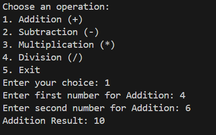

# Two-Operand Calculator (Java)

This is a simple **Java Calculator** created as part of the **Elevate Labs training task**.  
It demonstrates **Java syntax, methods, Scanner input, loops, and switch-case logic**.

---

## 🚀 Features

- Perform **basic arithmetic operations** on **two numbers**:
  - Addition (`+`)
  - Subtraction (`-`)
  - Multiplication (`*`)
  - Division (`/`)
- Division returns a **decimal result** for precision.
- Handles **division by zero** with an error message.
- Allows the user to perform **multiple calculations** until they choose to exit.

---

## 🛠️ How to Run

1. Save the file as `Calculator.java`.
2. Open terminal or command prompt in the folder containing the file.
3. Compile the program:

   ```bash
   javac Calculator.java
   java Calculator

   ```

## Sample Output:

=== Two-Operand Calculator ===

Choose an operation:

1. Addition (+)
2. Subtraction (-)
3. Multiplication (\*)
4. Division (/)
5. Exit
   Enter your choice: 1
   Enter first number: 10
   Enter second number: 5
   Result: 15

Choose an operation:
4
Enter first number: 10
Enter second number: 3
Result: 3.3333333333333335

## Project Structure

Task-1/
├── Calculator.java
├── README.md
└── outputScreens/
    ├── Menu.png
    ├── Add.png
    ├── Sub.png
    ├── Mul.png
    ├── Div.png
    ├── Division_By_Zero.png
    └── Exit.png


## Sample Output Screenshots

### Program Menu


### Addition Example



### Subtraction Example


### Multiplication Example


### Division Example


### Division by Zero


### Exit Program


