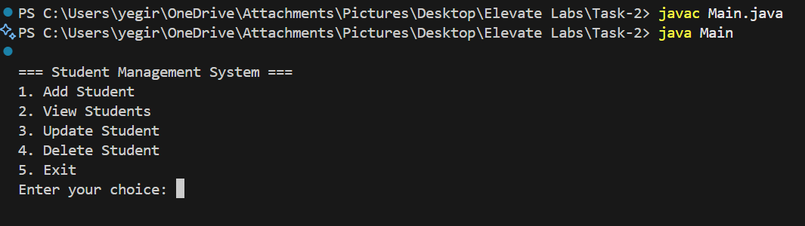
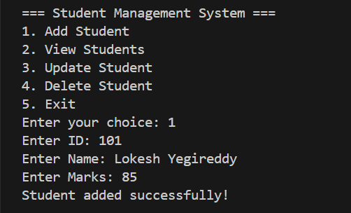
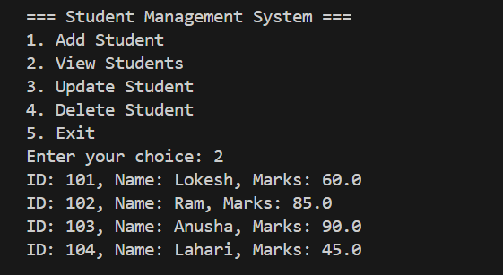
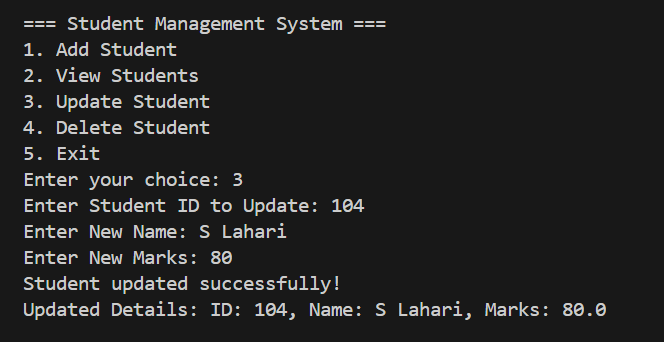
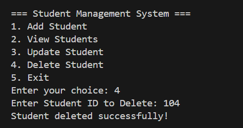
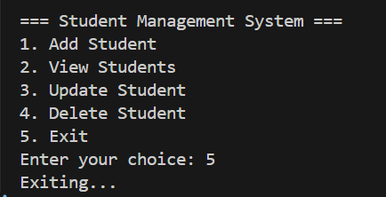

# Student Management System (Java) – Task 2

This is a simple **Java Console Application** created as part of the **Elevate Labs training task**.  
It demonstrates **Java OOP concepts, ArrayList, CRUD operations, and console input handling**.

---

## 🚀 Features

- Manage student records with **ID, Name, and Marks**.
- Perform **CRUD operations**:
  - Add Student
  - View Students
  - Update Student
  - Delete Student
- User-friendly console menu.
- Handles invalid inputs and empty lists gracefully.

---

## 🛠️ How to Run

1. Save the files as `Main.java`, `StudentDto.java`, and `StudentService.java`.
2. Open terminal or command prompt in the folder containing the files.
3. Compile the program:

   ```bash
   javac Main.java
   java Main
   ```

=== Student Management System ===

1. Add Student
2. View Students
3. Update Student
4. Delete Student
5. Exit
   Enter your choice:

Project Structure

Task-2/
├── Main.java
├── StudentDto.java
├── StudentService.java
└── outputScreens/
├── Menu.png
├── AddStudent.png
├── ViewStudents.png
├── UpdateStudent.png
├── DeleteStudent.png
└── Exit.png

## Sample Output Screenshots

### Program Menu



### Add Student



### View Students



### Update Student



### Delete Student



### Exit Program


