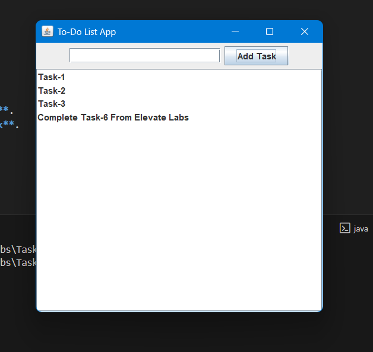
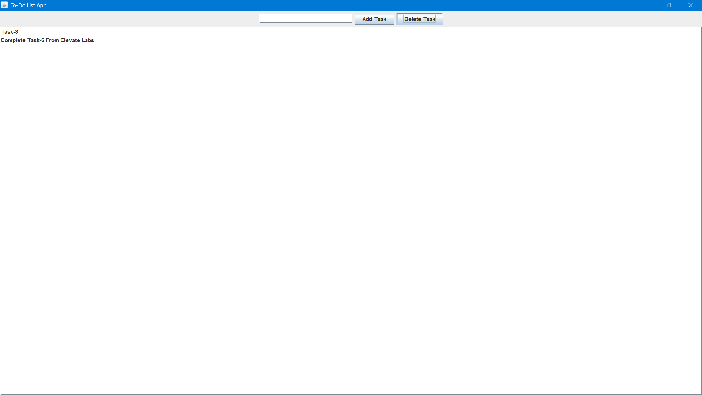

# Task-6: Java GUI – ToDo App

## 📌 Objective

Build a simple **To-Do List desktop application** using **Java Swing**.

## 🛠️ Tools

- Java JDK (8+)
- IntelliJ IDEA CE or Eclipse
- Swing (built-in, no extra installation needed)

## 📂 Project Structure

```
Task-6/
 ┣ Main.java
 ┣ ToDoApp.java
 ┣ README.md
 ┣ Screenshots/
 │   ┣ initial.png
 │   ┣ taskadded.png
 │   ┗ taskdeleted.png
 ┗ InterviewQuestions/
     ┗ InterviewQuestions.md

```

## 🚀 How to Run

1. Open project in IntelliJ or Eclipse.
2. Compile & Run `Main.java`.
3. A To-Do List window will open.
   - Type a task in the text field and click **Add Task**.
   - Select a task from the list and click **Delete Task**.

## 🎯 Features

- Add tasks dynamically.
- Delete selected tasks.
- Scrollable task list.
- Clean and simple Swing GUI.

## 📸 Screenshots

### Initial Window


### Task Added



### Task Deleted



## 📖 Interview Preparation

See [InterviewQuestions/InterviewQuestions.md](InterviewQuestions/InterviewQuestions.md)
